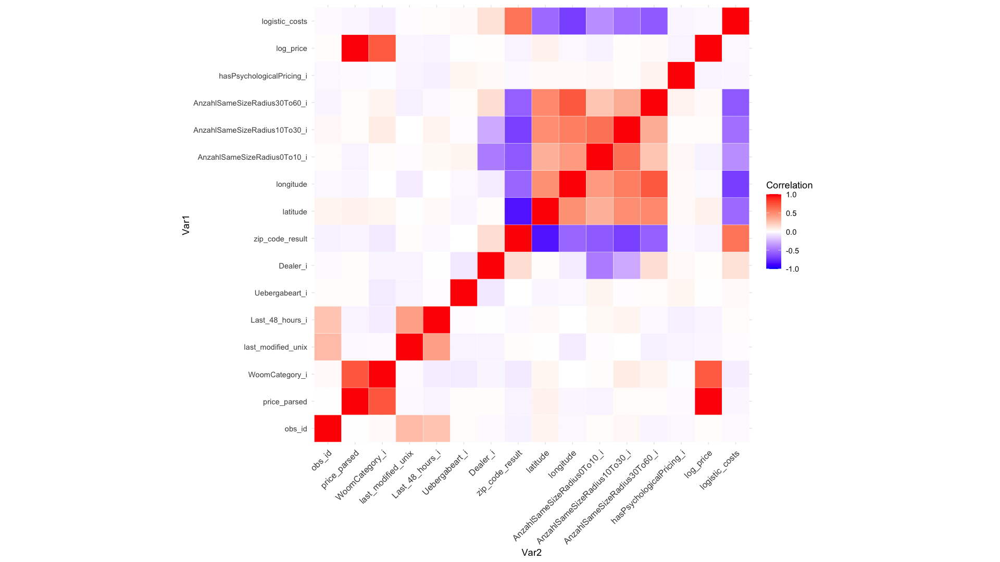

# woombikes-price-contagion
Repository for VU Online Marketplaces

**Observational Unit:** "Woom Bikes" (Marketplace → Sport / Sports Equipment → Bicycles / Cycling → Bicycles)

**Number:** Approximately 3,000+ (Two snapshots / Web Scraper Executions)

**Sample Size:** All, but only approximately 900 due to duplicates and missing values, especially for variables involved in further encodings.

**Correlation Heatmap:**

## Analysis of Willhaben Ads (Supply Side)

### Descriptive Statistics

### Model Specification (Draft)

#### Model 1: Base MLR Model

$$
logPrice_i = \beta_0 + \beta * X + u_i
$$

#### Description:
- $logPrice_i$: Observed ad listing price of product i on the marketplace, reflecting a proxy variable of the "realized" price.
- $X$: Matrix of explanatory variables for product i.

[statInference.log](logs/statInference.log)

#### Model 2: Spatial Regression Model

##### Model choice based on research aim / Summary of Cook et al. (2020)
Cook et al. (2020) emphasize guiding model selection based on research aims. For unbiased estimates of non-spatial parameters, use SDM -> includes both observable spillovers (Wy and Wx). For testing spatial theories, use SAC or SDEM -> distinguishes spillovers in observables (SAC: ρWy, SDEM: WXγ) from unobservables -> prevents erroneous conclusions about diffusion/spillovers by controlling for non-observable clustering sources (p. 738).

[spatial.log](logs/spatial.log)

## Data Sources

- Products with UVP: [Woom Official Website](https://woom.com/de_AT/)
- C2C Marketplace: [Willhaben Bicycles](https://www.willhaben.at/iad/kaufen-und-verkaufen/marktplatz/fahrraeder-radsport/fahrraeder-4552?sfId=b8725e40-07af-41a5-bb6d-6d32deed8220&rows=30&isNavigation=true&keyword=woom+4)
- All Woom B2C Resellers with Zip Codes and Country: [Dealer Locator](https://intl-checkout.woom.com/apps/dealerlocator)
- Shapefiles of Austria (Grid 1, 10 and 100 kilometres): [EEA EU](https://www.eea.europa.eu/data-and-maps/data/eea-reference-grids-2/gis-files/austria-shapefile)
- Austrian Zip Codes Data: According to ISO standard.

Example of scraping code using 'scrapy': [GitHub - scrapy-tutorials](https://github.com/maksimKorzh/scrapy-tutorials/blob/master/src/willhaben/willhaben.py)
